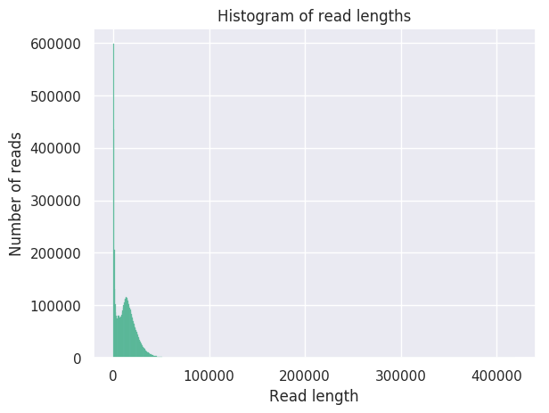

# Nanoplot

**Path to directory:** /projects/EBP/Wegrzyn/Moss/ppyriforme/assembly/nanoplot

Once the raw data was transferred onto the server, the first step was to analyse the raw data for basic stats, which includes total number of bases and the N50. 

See the result file [here](NanoStats.txt)

The number of reads versus the readlengths are shown in the following image:

The N50 is around 19k, and the reads were then further analysed with Centrifuge, to check to for contaminants.

## Program used:

Github link to [Nanoplot](https://github.com/wdecoster/NanoPlot)

De Coster, W., D’Hert, S., Schultz, D. T., Cruts, M., & Van Broeckhoven, C. (2018). NanoPack: visualizing and processing long-read sequencing data. Bioinformatics, 34(15), 2666-2669.
