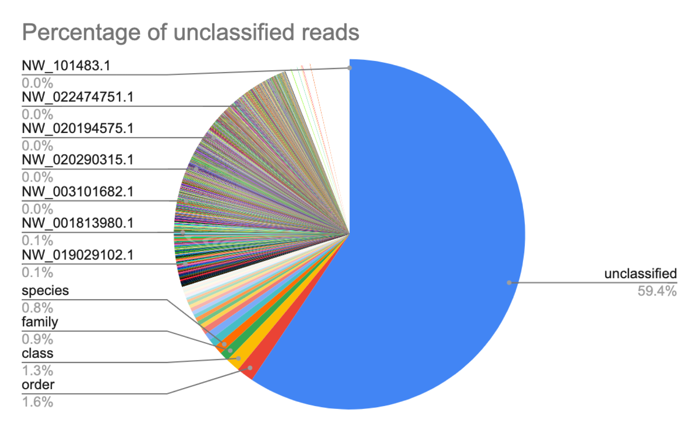

# Centrifuge

Once the raw data was analysed for its basic statistics, the next step was to run Centrifuge. Centrifuge is generaly used for metagenomics analysis, and in this context, running Centrifuge on our raw reads helps pick out potential contaminants. We built databases against archaea, bacteria, viral and fungal genomes.

## Download databases

**Path to directory**:/projects/EBP/Wegrzyn/Moss/ppyriforme/initial_analysis/centrifuge_14813/centrifuge_analysis/1_index

The first step was to download the relevant databases using "batch_download.sh". In the example file here, the databases shown are for arachea, bacteria and fungi
The resulting ".fna" files were concatenated using the "batch_cat.sh" file.

## Build indices

**Path to directory**:/projects/EBP/Wegrzyn/Moss/ppyriforme/initial_analysis/centrifuge_14813/centrifuge_analysis/1_index

Using "batch_build.sh", we can then create the index files required for the subsequent Centrifuge run. 

## Run Centrifuge

Detailed results over [here](https://docs.google.com/spreadsheets/d/1dP9y-3flTyNhfmaKZOK45OC5iAiRfZo9EIfqhqbUwi8/edit#gid=0)

We used the "centrifuge_minlen30.sh" script to run Centrifuge. There are three main outputs from this run, the ".tsv and .out" files list potential contaminants, and its relevant % contamination. The other result is a ".fasta" file of the non-contaminated reads.

**Summarised results:**
1. The result file used was "ppyriforme_unclassified_reads_prometh_only.fastq" in the directory: /projects/EBP/Wegrzyn/Moss/ppyriforme/assembly/centrifuge/abv_fungi_unclassified_reads_from_centrifuge
2. Total percent of reads *not* contaminated: ~64%
3. Main contaminants: Phycomyces blakesleeanus NRRL 1555(-), Saprochaete ingens, Rhizophagus irregularis DAOM 181602=DAOM 197198

### Program used:

Github link to [Centrifuge](https://github.com/DaehwanKimLab/centrifuge)

Kim, D., Song, L., Breitwieser, F. P., & Salzberg, S. L. (2016). Centrifuge: rapid and sensitive classification of metagenomic sequences. Genome research, 26(12), 1721-1729.
