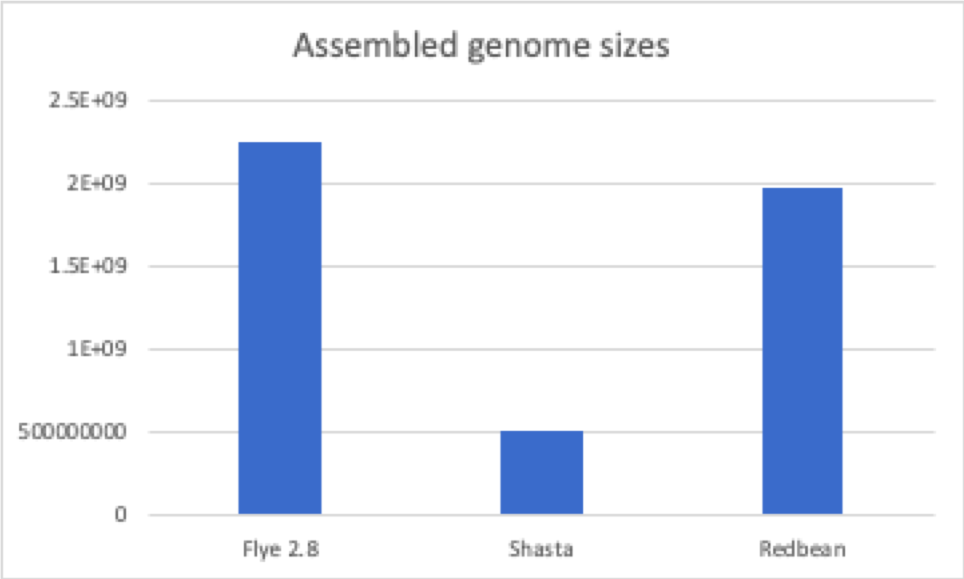
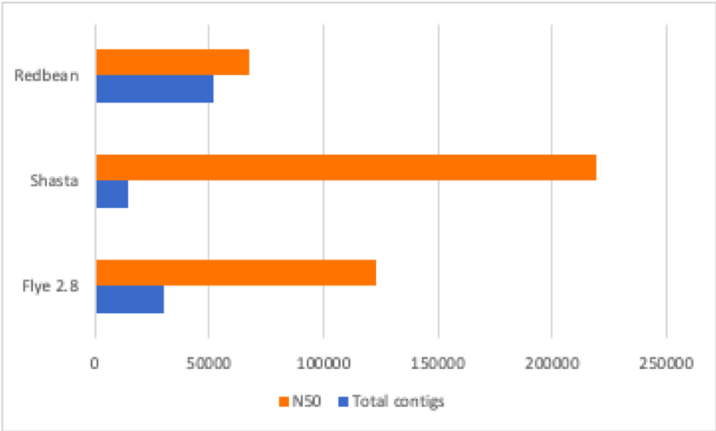

# Quality Control

## BUSCO
We used [BUSCO](https://github.com/openpaul/busco) to assess the level of completeness for each of our assemblies. All BUSCO runs were done against viridiplantae.

The three assemblies had different busco scores:

Assembly | BUSCO score |
--- | ---- |
Shasta | C:60.0%[S:46.8%,D:13.2%],F:7.1%,M:32.9%,n:425 |
Flye | C:88.9%[S:60.7%,D:28.2%],F:2.4%,M:8.7%,n:425 |
Redbean | C:68.9%[S:56.7%,D:12.2%],F:12.0%,M:19.1%,n:425 |

## QUAST
We used [QUAST](https://github.com/ablab/quast) to assess quality & level of contamination for each of our assemblies. 

Comparison of assembled genome sizes:

Comparison of read lengths and N50:

## Discussion

Looking at the quast results, shasta had the highest N50, and redbean had the most number of contigs. Looking at the combination of N50 and total contigs of redbean, it looks like this assembly is the most fragmented assembly, shasta is the most contiguous assembly, and flye had intermediate values. In comparison, looking at the BUSCO score, flye has the most complete genome in comparison to the other assemblies. 
However, looking at the assembled genome sizes, there is a huge difference in genome sizes between shasta, flye and redbean. Shasta assembled a small genome of around 500Mb. In comparison, flye and redbean assembled genomes of around 2Gbp. We hypothesie that Shasta assembled a contaminant, and therefore this assembly will not be considered for future analysis. The flye and redbean genomes will be further analysed, with additional polishing steps. For future steps, we are waiting on additional short-read data, and this will be used to create more robust assemblies. While we first assumed that the genome size is 500Mb based on flow cytometry data, it looks like the sample is a polyploid genome, with a genome size of around 2Gbp.

## References

Gurevich, A., Saveliev, V., Vyahhi, N., & Tesler, G. (2013). QUAST: quality assessment tool for genome assemblies. Bioinformatics, 29(8), 1072-1075.

Simão, F. A., Waterhouse, R. M., Ioannidis, P., Kriventseva, E. V., & Zdobnov, E. M. (2015). BUSCO: assessing genome assembly and annotation completeness with single-copy orthologs. Bioinformatics, 31(19), 3210-3212.
