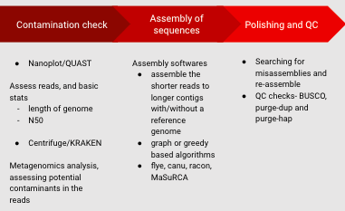

# Genome Assembly of _Physcomitrium pyriforme_

Physcomitrium pyriforme genome assembly proposal
Polyploidy is the state of having entire multiples of a haploid set of chromosomes. We know that whole-genome duplication is ubiquitous across plants. Phylogenetic reconstructions show us that polyploids have arisen repeatedly in the past and produce genetic novelty which facilitates diversification (Doyle & Coate, 2019). Allopolyploids, the product of genome doubling following hybridization, present unique challenges to genomic study since they combine the genomes of two parental lineages. In angiosperms, genome studies largely focus on the dominant sporophytic life phase. The gametophytic phase of their life cycle is difficult to study in that it typically comprises only a few cells within the floral structure. In contrast, the bryophyte life cycle is haploid dominant. Mosses are thus amenable to studies focusing on the haploid phase. This project focuses on the moss genome of Physcomitrium pyriforme (Hedw.), which preliminary data from flow cytometry and phylogenomic analysis reveal to be an allopolyploid. This study system offers a unique perspective from which to observe allopolyploid plant genomes in general. It will be one of the first genome assemblies of an allopolyploid organism with a haploid dominant life form.
This project aims to compare the assembly quality produced by four genome assemblers, using long reads data produced from Promethion Oxford Nanopore. We predict that the size of our genome (500 Mb) and our use of long-read data will make our dataset more amenable to assembly using certain tools. We will implement the following assemblers: MaSuRCA, Flye, Shasta, and Velvet (Kolmogorov et al., 2019; Shafin et al., 2020; Zerbino, 2010; Zimin et al., 2013). Completeness will be measured with BUSCO (Benchmarking with Universally accepted Single Copy Orthologs) scores.  We hypothesize that MaSuRCA will generate the most complete assembly, as recent studies have shown it to be effective when assembling allopolyploid genomes from long-read nanopore sequences (Li et al., 2017; Zimin et al., 2013). We hypothesize that Flye will produce a comparably complete assembly because it leverages repeat graphs to more accurately assemble error-prone long reads (Kolmogorov et al., 2019).
	We will use QUAST (Gurevich et al., 2013) and BUSCO (Simão et al., 2015) to assess the results of each genome assembly by examining statistics including contig length, complete BUSCO genes, and duplicated BUSCO genes, N50, L50, and total alignment length. 

## Research Approach

We will be comparing different assemblers in how they would assemble a genome of around 500Mbp. The sequencing technology used for obtaining the reads for our genome is, Promethion, from Oxford Nanopore. The genome assembly process starts from assessing the quality of reads from the sequencing technology. Centrifuge (Kim et al., 2016), or Kraken (Wood & Salzberg, 2014) are both metagenomics analyzers that search for sequences that may be sourced from bacteria, fungi, or other species. There are options in the program to remove the contaminant reads to improve the quality of the sequenced reads. The use of BUSCO and QUAST is important to assess the quality of the reads, before and after any contaminant checks. BUSCO compares the reads to a set of universally accepted single-copy orthologs and gives an overall score of completeness, scores to estimate duplication and missing/fragmented genes (Simão et al., 2015). QUAST is a standalone tool that assesses an input FASTA file for generic statistics like N50, length of the sequence, number of reads, etc. Once the sequence is cleared of any contaminants, the next step is to assemble the genome (Gurevich et al., 2013). 

**Figure 1**: Process of genome assembly

As mentioned above, the different assemblers that would be considered in this project are MaSuRCA, Flye, Shasta, and Velvet. MaSuRCA (Maryland Super-Read Celera Assembler) plays to the strengths of methods like de Bruijn and the overlap-consensus approaches in building an assembly. MaSuRCA works well on short-read data, like the ones produced by Illumina, and can also incorporate data from long-read sequencing technologies like Nanopore (Zimin et al., 2013). Flye is also an assembler that works with long-reads. Flye focuses on repeat characterization and uses a de Bruijn graph to find overlaps between reads. It does not require the reads to be error corrected (Kolmogorov et al., 2019). Shasta is also an assembler that uses long reads and uses read-length encoder algorithms to deal with homopolymer repeats. It also uses markers- a fixed subset of k-mers of around 10 to aid in assembly (Shafin et al., 2020). Velvet, on the other hand, is a short-read assembler that uses the de Bruijn graph to resolve repeats. It also outputs statistics on the assembly produced (Zerbino, 2010). 
Following genome assembly, there are multiple rounds of post-assembly quality checks. For a “good” genome assembly (measured and chosen by comparing BUSCO and QUAST scores), the next step is to polish the genome. In this step, the polishing algorithm checks and corrects errors in the genome. A potential software to be used in this step is Medaka (Medaka — Medaka 1.2.4 Documentation, n.d.). Once a genome sequence is considered good enough, the sequence can then be used to carry out genome annotation. 

## Preliminary results

Centrifuge/Kraken results are in this spreadsheet: https://docs.google.com/spreadsheets/d/11go67Dql56dhhBo1JlUH7nulwTDp2iDw1IhnIql3CwQ/edit#gid=1318488447

**BUSCO scores after shasta run**: C:60.0%[S:46.8%,D:13.2%],F:7.1%,M:32.9%,n:425

**QUAST analysis**
| Statistic | Measurement |
| ---- | --- |
| Largest contig | 8400060 |
| Total length | 507570095 |
| GC (%) | 54.99 |
| N50  | 219561 |
| N75  38860 |
| L50 | 318 |
| L75  | 1876 |
| N's per 100 kbp | 0.00 |

And after medaka polishing: C:65.9%[S:51.5%,D:14.4%],F:5.2%,M:28.9%,n:425

## References 

Doyle, J. J., & Coate, J. E. (2019). Polyploidy, the Nucleotype, and Novelty: The Impact of Genome Doubling on the Biology of the Cell. International Journal of Plant Sciences, 180(1), 1–52.

Gurevich, A., Saveliev, V., Vyahhi, N., & Tesler, G. (2013). QUAST: quality assessment tool for genome assemblies. Bioinformatics , 29(8), 1072–1075.
Kim, D., Song, L., Breitwieser, F. P., & Salzberg, S. L. (2016). Centrifuge: rapid and sensitive classification of metagenomic sequences. Genome Research, 26(12), 1721–1729.

Kolmogorov, M., Yuan, J., Lin, Y., & Pevzner, P. A. (2019). Assembly of long, error-prone reads using repeat graphs. Nature Biotechnology, 37(5), 540–546.
Li, C., Lin, F., An, D., Wang, W., & Huang, R. (2017). Genome Sequencing and Assembly by Long Reads in Plants. Genes, 9(1). https://doi.org/10.3390/genes9010006

Medaka — Medaka 1.2.4 documentation. (n.d.). Retrieved March 8, 2021, from https://nanoporetech.github.io/medaka/

Shafin, K., Pesout, T., Lorig-Roach, R., Haukness, M., Olsen, H. E., Bosworth, C., Armstrong, J., Tigyi, K., Maurer, N., Koren, S., Sedlazeck, F. J., Marschall, T., Mayes, S., Costa, V., Zook, J. M., Liu, K. J., Kilburn, D., Sorensen, M., Munson, K. M., … Paten, B. (2020). Nanopore sequencing and the Shasta toolkit enable efficient de novo assembly of eleven human genomes. Nature Biotechnology, 38(9), 1044–1053.

Simão, F. A., Waterhouse, R. M., Ioannidis, P., Kriventseva, E. V., & Zdobnov, E. M. (2015). BUSCO: assessing genome assembly and annotation completeness with single-copy orthologs. Bioinformatics , 31(19), 3210–3212.

Wood, D. E., & Salzberg, S. L. (2014). Kraken: ultrafast metagenomic sequence classification using exact alignments. Genome Biology, 15(3), R46.
Zerbino, D. R. (2010). Using the Velvet de novo assembler for short-read sequencing technologies. Current Protocols in Bioinformatics / Editoral Board, Andreas D. Baxevanis ... [et Al.], Chapter 11, Unit 11.5.

Zimin, A. V., Marçais, G., Puiu, D., Roberts, M., Salzberg, S. L., & Yorke, J. A. (2013). The MaSuRCA genome assembler. Bioinformatics , 29(21), 2669–2677.

